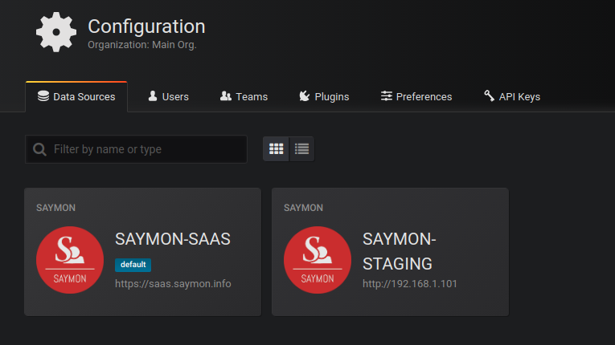
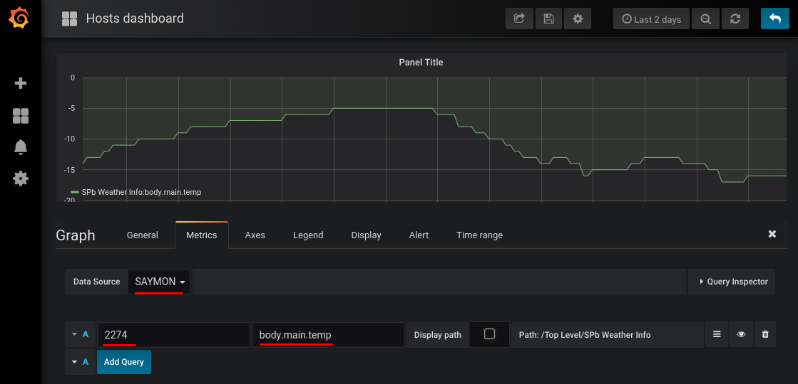

# SAYMON Datasource For Grafana

This plug-in provides a datasource to access [SAYMON](https://saymon.info/en-version/) metric data from objects of interest.



## Installation

This plug-in can be installed using Grafana CLI:

```
grafana-cli plugins install untu-saymon-datasource
```

## Configuration And Usage

1. Select SAYMON datasource from Data Sources configuration page:


2. Configure SAYMON datasource by entering your SAYMON installation public URL and user credentials:


3. Create a new graph on your dashboard, and open graph configuration. Select SAYMON datasource and enter
SAYMON object ID and metric name. After this, graph data will be displayed.



### Multiple data sources

You can create multiple SAYMON data sources, each for separate SAYMON installation.